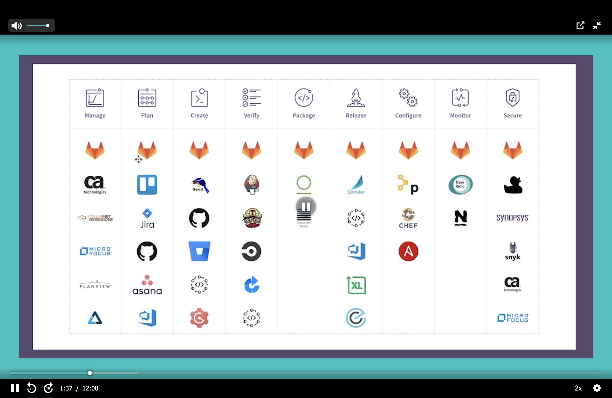
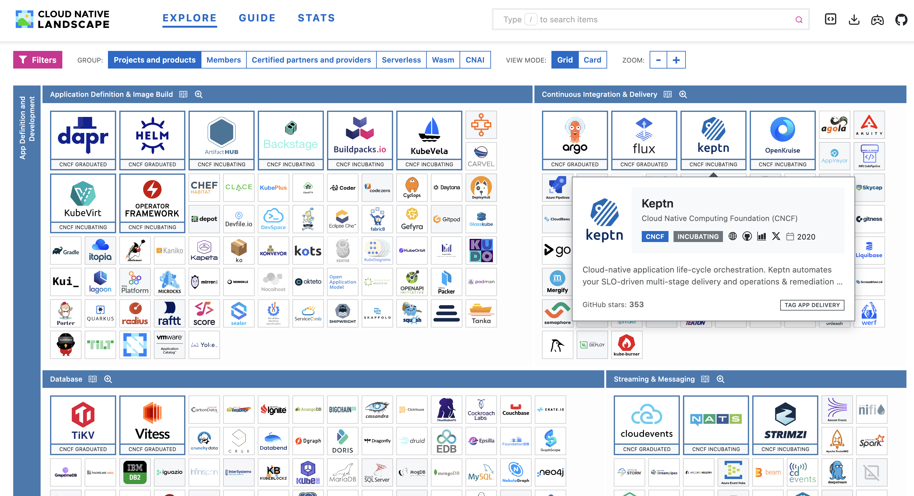

### Don't :
* do over-engineering -> Simple design is better 
* add any tools that you don't need it
* choose a tool base on recommendation -> check usability 
### [Digitial.ai](https://digital.ai/learn/devsecops-periodic-table/)

### [Gitlab.com](https://gitlab.com)

### [landscape.cncf.io](https://landscape.cncf.io)
### Check it periodically for news and contributing if you can. 
(Google cloud native commutation)

#### CNCF Project maturity levels:
* Graduated (in Laboratory step)
* Incubating (in Deployment step)
* Sandbox (in as a Production use step)

### If You want to choose a tool:
* Check alternative (Benchmarks)
* Get exact reason for selection
