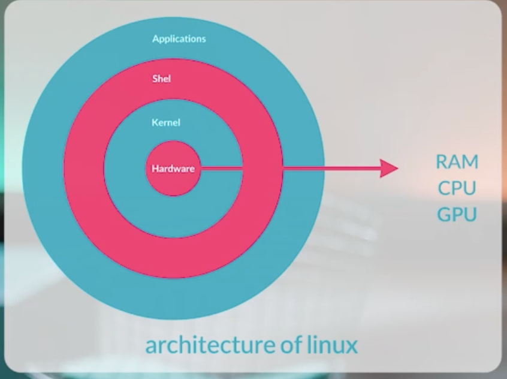

### Linux architecture


### type of process
- foreground
- background
 


### Daemon
The process that run in background and we can manage it.

### Processes states
- Read
- Waiting
- Running
- Terminate 
#### Zombie process
the processes that their parents were gone.

#### Single or Multithread
process can be run as single or multithread.

## Process management commands

```bash
jobs
```

show processes that run in background

```bash
sudo apt update &
```

this command run update in background

```bash
fg 1
```

this command transfer process whit id 1 in jobs to forground

```bash
top
```

show list of process with source detail 

```bash
ps -aux
```

return list of run process 

```bash 
ps -aux | grep docker
```

return process list and search with grep

```bash
pidof nginx
```

return id of process with run as Nginx

```bash
htop
```

htop is graphical of top

```bash
top
```

- shift + m : sort by memory usage
- shift + u : filter by user name
- shift + p : sort by cpu usage

```bash
kill -9 pid
```

kill permanently the process with process id

```bash
pidof nginx | xargs  kill -9 
```

kill permanently  list of pid's Nginx

```bash
sudo apt install iotop
iotop
```

show list of process sorted by IO usage
