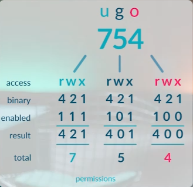

The most popular commands are:
* chmod 
	* 3 types of permissions: r: read, w: write and x: execute 
	* u: user, g: group, o: others
	* First bit is d: directory, -: file
	 
	* by + or -  we can add or remove permissions to files or dirs
* chown: set owner of file/dir  ->   `` chown USER:GROUP FILENAME ``
* lsattr
* chattr
	* A: The atime record is not updated.
	- S: The changes are updated synchronously on the disk.
	- a: File can only be opened in append mode for writing.
	- i: File cannot be modified (immutable), the only superuser can unset the attribute.
	- j: All of files information is updated to the ext3 journal before being updated to the file itself.
	- t: No tail-merging is allowed.
	- d: No more candidate for backup when the dump process is run.
	- u: When such a file is deleted, its data is saved enabling the user to ask for its undeletion.
		 examples:
		* immutable:  can not changes   ->   ``chattr +i FILENAME``
		* append-able  just append          ->   ``chattr +a FILENAME``


**Echo command:**
```shell
echo 1 > FILENAME  #write 1 into file
echo 2 >> FILENAME  #Add 1 to end of file as a new line
```