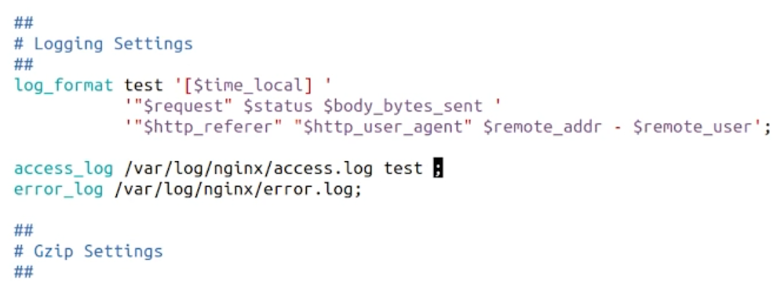
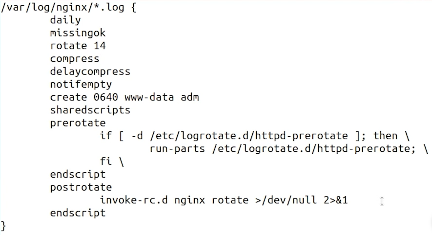

### Logs and Metrics
Are our eyes to watch and analyse the system events.
Formatting log is so important due to setting queries and reading it again.
Both of the logs should be kept beside each other:
* Service Log
* Server Log

**Logging:** Accumulating and storing logs in a place
**Note:** Use log rotate to manage the logs that are growing rapidly. It's going to compress logs by a period of time or volume.
### Central Logging
Send logs to other servers to avoid manipulating by hackers. They remove footprint after attack.

### Netstat
Which service is running on special port
```shell
sudo netstat -ntlp | grep 80
```
### Nginx log sample
Example of changing log format for nginx on */var/log/nginx/\*.log*

**Note:** *test* in log_format should be add to access or error log, too.

Nginx Log Rotate Configuration on */etc/logrotate.d/nginx*


**Note:** All user Authentications (logins, logouts, etc) log is in  */var/log/auth.log*
**Prevent to Display Nginx version:** Hardening -> Add this line to nginx config ``server_token off``
