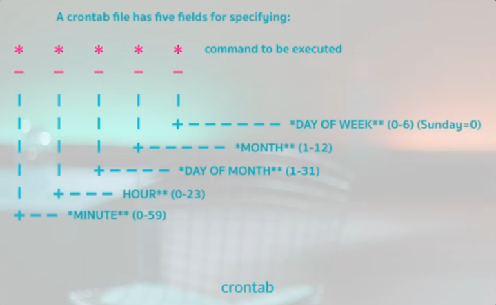

**PipeLine ( | sign ):** Each commands in Linux has three type of state that can be written in file, displayed in monitor or sent to other commands as an input :
*  **0**: Std in           -> whatever we enter to system
*  **1**: Std out        -> whatever goes out from system
*  **2**: Std error     -> errors

**Crontab:** Set schedule for doing some action automatically, ex. backup db, run an bash file, etc. The best way is coding a script an set that in schedule. All the files are in */etc/cron.d*

**Note:** Can be set for after rebooting.
to work with Crontab, this parameters can be useful:
* **-l** : Display list
* **-r** : Remove a schedule
* **-e** : Edit file
