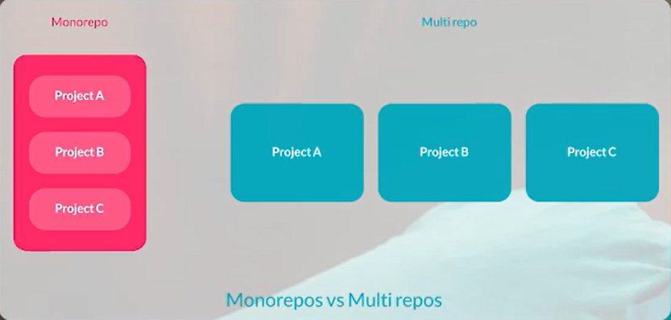

### Branch
Create it when you have to work in new feature or fix a bug. Then remove it when merged with main branch.

### Commands
```bash
git init     #Create new repository
git clone    #Download a repo from remote server to local
git commit   #Action Labeling
git push     #Upload commited changes
git pull     #Download commited changes
git log      #Steps and details about what happened
git status   #Whats changed we have and info about stage of files and dirs
git brance   #Create new one
git checkout #Switch between branches and back to a state -b go to a branch and -d delete a branch
git tag      #Use for going to a stable tag
git rebase   #Our branch commits merge with main branch -> make the flow more clear
git revert   #Go to a commit and rewrite on newer commits
git reset    #Back local changes to what we have in remote opt: mixed, soft, hard
```

### Readme file
Useful for getting info about repo (Markdown Language):
* Configuration
* Installation
* Usage
* Requirement
* Variables
* How to Build
* Maintenance
* Authors infographic 

### Monorepos vs Multirepos

Multi is better for CI/CD.
Mono is better to keep in same place.