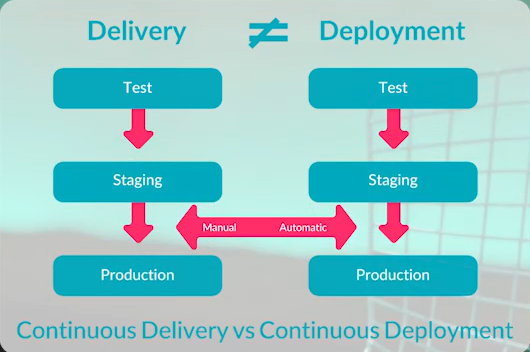

### Continuous Integration and Continuous Delivery/Deployment
Automating Build, Test and Release steps.
Make deployment easier and more rule-based.
Try to make human failures zero.

**Continuous Integration:** Test codes in building process to make sure about what happen during the main build. Reduce the risks.

**Continuous Delivery vs Deployment:**

Delivery is better than Deployment.

